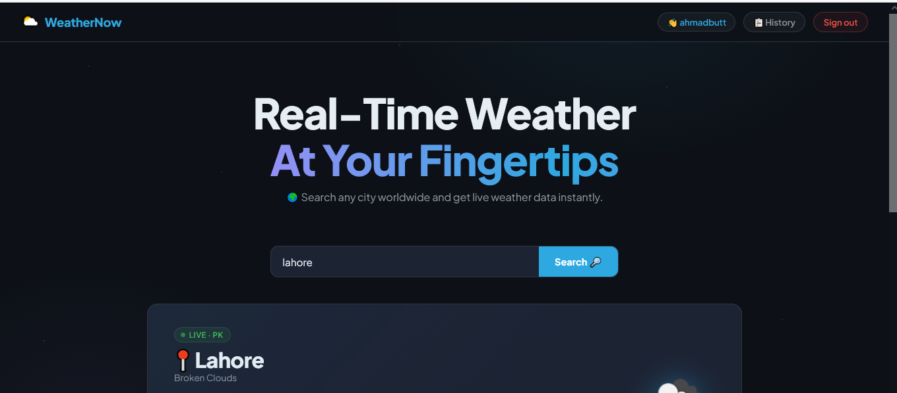
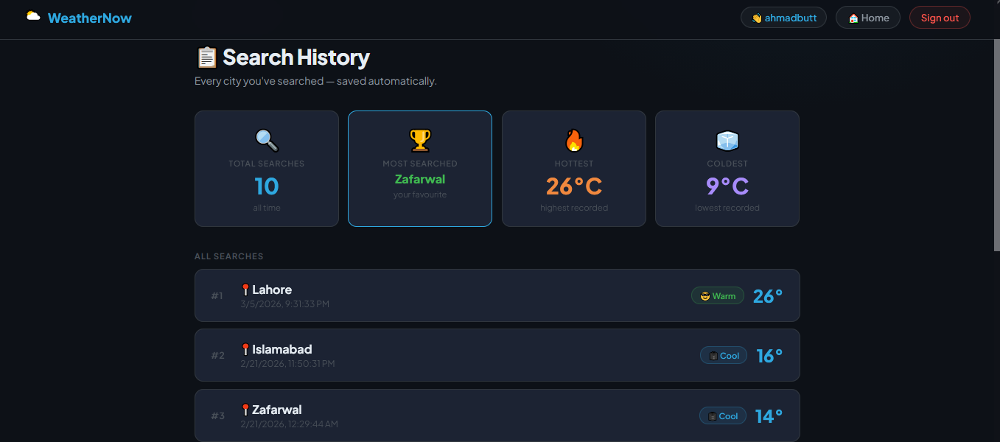
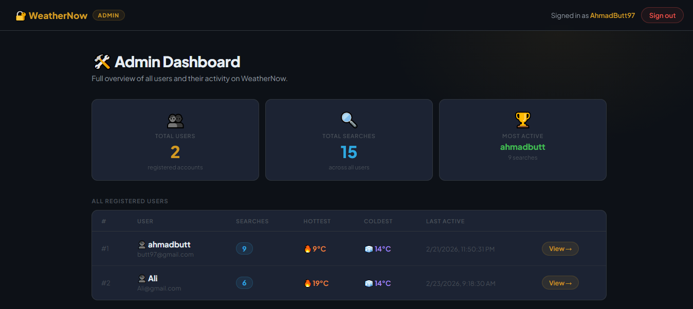

# 🌤️ WeatherNow

> Real-Time Weather At Your Fingertips — Search any city worldwide and get live weather data instantly.

---

## 🚀 Features

- 🔍 **City Weather Search** — Search any city and get live weather data powered by OpenWeather API
- 📜 **Search History** — Every city you search is automatically saved to a MySQL database
- 👤 **User Accounts** — Register/login to track your personal search history
- 🏆 **Admin Dashboard** — Root admin can monitor all users, total searches, most active users, hottest & coldest recorded temps
- 📊 **User Stats** — View most searched city, hottest & coldest temperatures per user

---

## 📸 Screenshots

### 🌍 User — Weather Search


### 📜 User — Search History


### 🛠️ Admin — Dashboard


---

## 🛠️ Tech Stack

| Layer | Technology |
|-------|-----------|
| Frontend | EJS, HTML, CSS |
| Backend | Node.js, Express.js |
| Database | MySQL |
| Weather API | OpenWeatherMap API |
| Auth | Session-based Authentication |

---

## ⚙️ How It Works

### 👤 User Flow
1. User registers or logs in
2. Searches for any city in the world
3. Live weather data is fetched from OpenWeather API
4. Search is **automatically saved** to MySQL database
5. User can view full search history with stats (most searched, hottest, coldest)

### 🛡️ Admin Flow
1. Admin logs in with root credentials
2. Views **all registered users** and their activity
3. Sees total searches across all users
4. Can view individual user search history via **View →** button
5. Tracks most active user, hottest & coldest recorded temperatures per user

---

## 🗄️ Database Schema

### `users` table
```sql
id | username | email | password | role (user/admin)
```

### `weather_searches` table
```sql
id | user_id | city | temperature | searched_at
```

---

## 🔧 Installation & Setup

### 1. Clone the repo
```bash
git clone https://github.com/AhmadButt97/Weather_App.git
cd Weather_App
```

### 2. Install dependencies
```bash
npm install
```

### 3. Create `.env` file
```env
DB_HOST=localhost
DB_USER=root
DB_PASSWORD=yourpassword
DB_NAME=weatherapp
API_KEY=your_openweather_api_key
SESSION_SECRET=your_secret_key
```

### 4. Set up MySQL database
```bash
mysql -u root -p < db/schema.sql
```

### 5. Run the app
```bash
node server.js
```

Visit: `http://localhost:3000`

---

## 🔐 Admin Access

To create an admin account, set `role = 'admin'` directly in the `users` table in MySQL:

```sql
UPDATE users SET role = 'admin' WHERE username = 'AhmadButt97';
```

---

## 📁 Project Structure

```
Weather_App/
├── config/
│   └── db.js              # MySQL connection
├── models/
│   ├── userModel.js
│   └── weatherModel.js
├── public/
│   └── css/
│       └── style.css
├── views/
│   ├── index.ejs          # Home / weather search
│   ├── login.ejs
│   ├── signup.ejs
│   ├── history.ejs        # User search history
│   ├── admin.ejs          # Admin dashboard
│   ├── admin-login.ejs
│   └── admin-user-history.ejs
├── server.js
├── .env                   # ⚠️ Never commit this
├── .gitignore
└── package.json
```

---

## 🌐 API Used

- [OpenWeatherMap API](https://openweathermap.org/api) — Free tier supports 60 calls/minute

---

## 👨‍💻 Author

**Ahmad Butt** — [@AhmadButt97](https://github.com/AhmadButt97)
